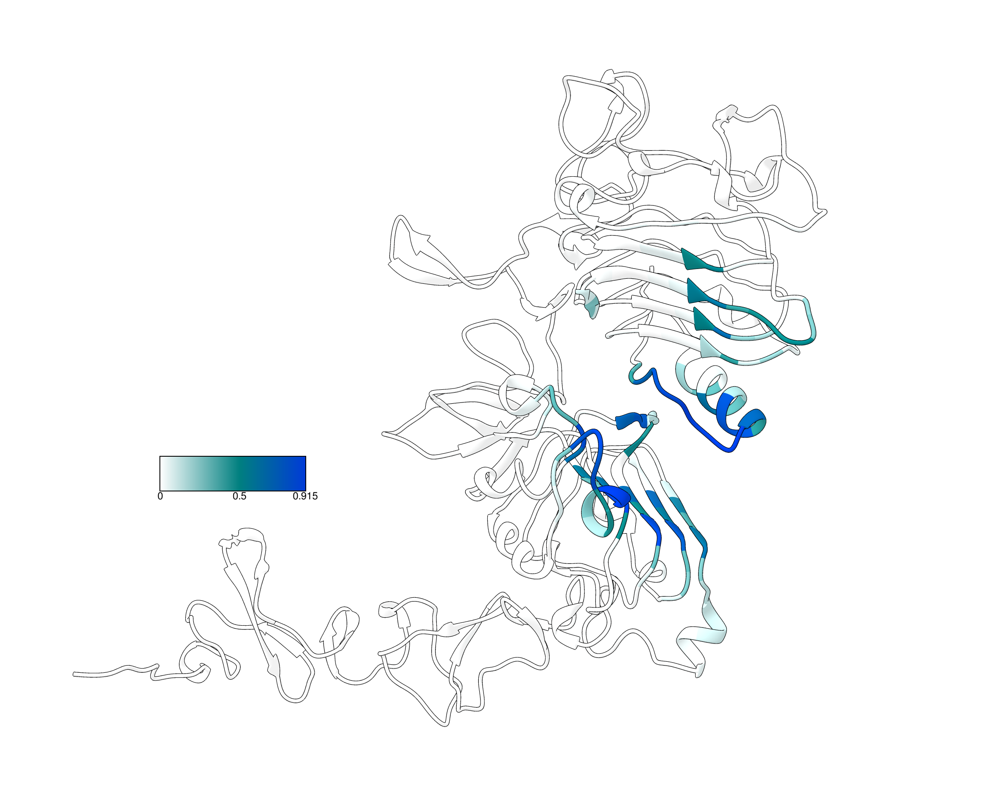

# EGFR Contact Frequency Demo

I used Adaptyv_contacts_check.py to create an attribute file (contacts_round2_test1.txt) to map the frequency of binder contacts onto a structure of EGFR. The idea was to make a figure showing which residues of EGFR were most often targeted by participants' binder designs.

For example, the figure below shows the contact frequency for all Round 2 designs. (Contact cutoff = 10 Å between CA atoms)

  

